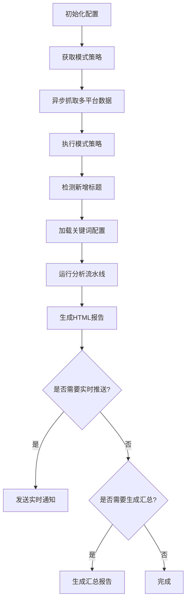
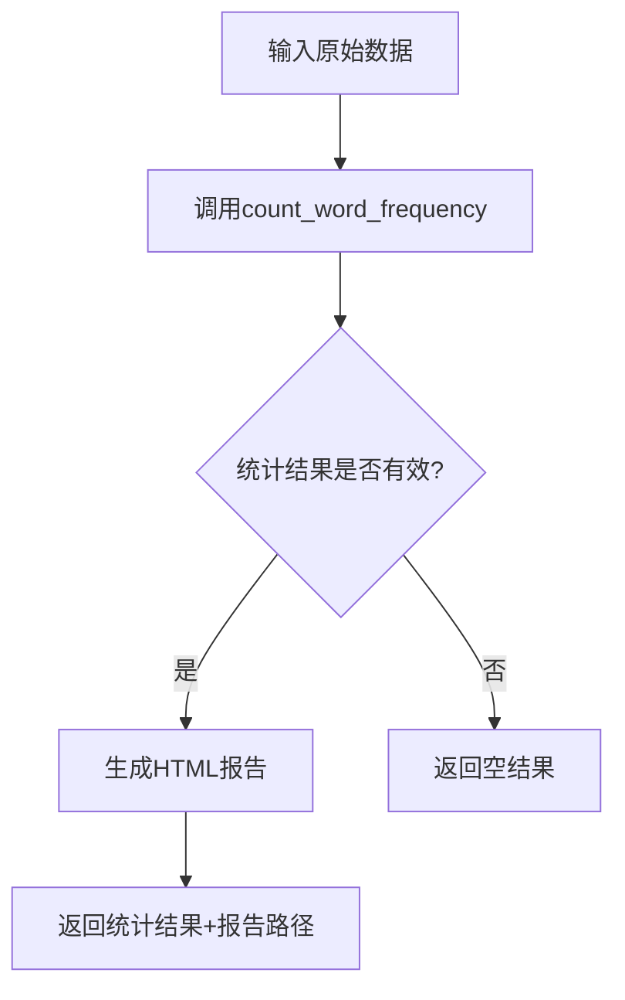
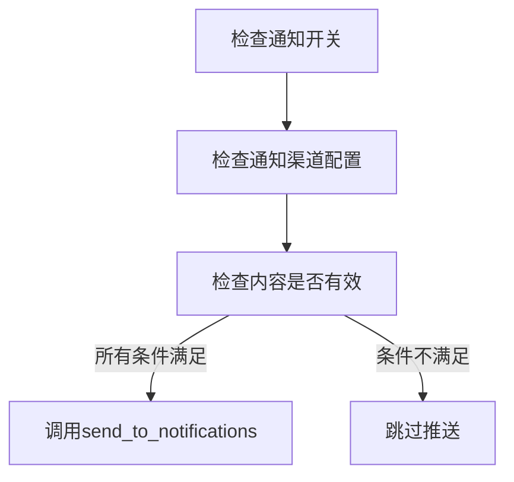

# TrendRadar 系统架构与信息流转文档

## 1. 系统概述
TrendRadar是一个多平台热点新闻监控与推送系统，核心功能是实时抓取各平台热点新闻，基于关键词过滤后向用户推送分析报告。

## 2. 核心模块
系统主要由5个核心模块构成：

| 模块 | 功能 |
|------|------|
| **爬虫模块** (`DataFetcher`) | 异步/同步抓取多平台热点新闻数据 |
| **配置模块** (`load_config`) | 加载并验证系统配置 |
| **分析模块** (`count_word_frequency`) | 基于关键词统计与过滤新闻 |
| **报告模块** (`_run_analysis_pipeline`) | 生成HTML报告 |
| **通知模块** (`send_to_notifications`) | 向多渠道推送分析结果 |

## 3. 数据流转架构
```
┌─────────────────┐     ┌─────────────────┐     ┌─────────────────┐
│   爬虫模块       │     │   分析模块       │     │   通知模块       │
│ (DataFetcher)   │     │ (Analysis)      │     │ (Notifications)  │
├─────────────────┤     ├─────────────────┤     ├─────────────────┤
│ 1. 异步抓取多平台 │     │ 1. 关键词统计    │     │ 1. 多渠道推送    │
│ 2. 数据格式标准化 │────▶│ 2. 热点过滤      │────▶│ 2. 批量发送处理  │
│ 3. 错误重试机制  │     │ 3. 热度排名      │     │ 3. 推送历史记录  │
└─────────────────┘     └─────────────────┘     └─────────────────┘
```

## 4. 详细流程
### 4.1 主流程 (`run()`)
系统入口为 `NewsAnalyzer.run()`，执行流程如下：



### 4.2 分析流水线 (`_run_analysis_pipeline`)


### 4.3 通知流程 (`_send_notification_if_needed`)


## 5. 关键函数详解
### 5.1 数据抓取层
- `DataFetcher.fetch_data_async()`: 异步抓取单个平台数据，支持重试与代理
- `DataFetcher.crawl_websites_async()`: 并发抓取所有配置的平台数据

### 5.2 数据分析层
- `count_word_frequency()`: 核心统计函数，支持：
  - 关键词精确匹配
  - 短语匹配（单行短语）
  - 必选关键词过滤
  - 排除关键词过滤
  - 热度加权排名
  - 按配置位置排序 (`sort_by_position_first` 配置)
  - 单关键词新闻数量限制 (`max_news_per_keyword` 配置)
  - 关键词组内数量限制 (`@` 前缀语法)

### 5.3 通知层
- `send_to_notifications()`: 统一推送入口，支持：
  - 飞书/钉钉/企业微信/Telegram/邮件/Slack/ntfy
  - 批量发送（避免超出发送限制）
  - 推送时间窗口控制
  - 推送历史去重
  - 失败自动重试
  - 支持代理发送

## 6. 配置文件
系统配置集中在 `config/config.yaml`，主要配置项：
- 监控平台列表
- 关键词过滤规则
- 通知渠道配置
- 抓取间隔与超时
- 推送时间窗口
- 报告配置：
  - `sort_by_position_first`: 是否按关键词在配置文件中的位置排序
  - `max_news_per_keyword`: 每个关键词显示的最大新闻数量

## 7. 扩展能力
系统支持灵活扩展：
- **新增平台**: 在CONFIG["PLATFORMS"]中配置平台ID
- **新增通知渠道**: 实现`send_to_xxx`函数并注册到通知流程
- **自定义分析规则**: 修改`count_word_frequency`逻辑
